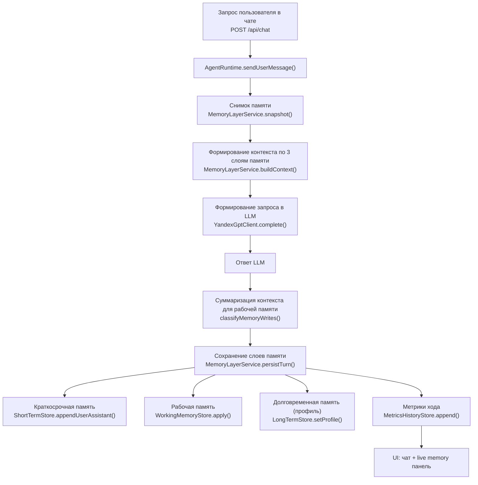

# Week 03

## Цель

Реализовать `task1` с явной моделью памяти ассистента (memory layers):

- краткосрочная память (`short_term`) — текущий диалог;
- рабочая память (`working_memory`) — данные текущей задачи;
- долговременная память (`long_term_memory`) — профиль и устойчивые знания.

## Что реализовано

- Многомодульный Gradle-проект:
  - `shared` — общее ядро (`env`, runtime, LLM client, memory stores).
  - `task1` — Ktor API с memory layers и метриками.
- Переиспользуется корневой `.env`.
- Разные типы памяти хранятся отдельно.
- `long_term_memory` заполняется только выбранным профильным агентом, не из диалога.

## Структура

- `shared/src/main/kotlin/week03/shared/config/AppEnv.kt` — загрузка переменных из `.env` и `System.getenv`.
- `shared/src/main/kotlin/week03/shared/model/ChatModels.kt` — модели чата, memory layers, metrics points.
- `shared/src/main/kotlin/week03/shared/storage/MemoryStores.kt` — отдельные JSON stores для short/working/long.
- `shared/src/main/kotlin/week03/shared/storage/MetricsHistoryStore.kt` — история метрик памяти.
- `shared/src/main/kotlin/week03/shared/agent/AgentProfiles.kt` — каталог из 3 профильных ролей.
- `shared/src/main/kotlin/week03/shared/agent/MemoryLayerService.kt` — orchestration слоев памяти + выбор профиля.
- `shared/src/main/kotlin/week03/shared/agent/AgentRuntime.kt` — пайплайн turn: context -> answer -> classify -> persist.
- `shared/src/main/kotlin/week03/shared/llm/ChatLlmClient.kt` — generation + auto-classifier через LLM.
- `task1/src/main/kotlin/week03/task1/Task1Server.kt` — API task1 и обработка UI.
- `task1/src/main/kotlin/week03/task1/Task1Ui.kt` — web UI (чат + live memory layers).

## Файлы памяти и метрик

- `weeks/week03/task1/short_term.json`
- `weeks/week03/task1/working_memory.json`
- `weeks/week03/shared/long_term_memory.json` (общий long-term слой для week3)
- `weeks/week03/task1/metrics_history.json`

## Правила записи по слоям

- `short_term`: сохраняются все пары user/assistant, хранится ограниченное окно сообщений.
- `working_memory`: пишутся только данные текущей задачи (goal/constraints/decisions/open questions/notes) через LLM classifier.
- `long_term_memory`: формируется только выбранным профилем из dropdown в UI.
- Для `working` запись идет через LLM classifier (`classifyMemoryWrites`) с:
  - `layer=WORKING`, `key`, `value`, `reason`, `confidence`.
- Для `long_term` запись из диалога отключена.
- Guardrails:
  - отбрасываются пустые записи;
  - ограничивается длина value;
  - не пишутся дубликаты;
  - применяется порог confidence.

## Запуск

Из корня `weeks/week03`:

```bash
./run-gradle.sh :task1:run
```

После запуска откройте:

- http://127.0.0.1:6001

UI:

- левая колонка: чат (сообщения user/assistant);
- правая колонка: live-состояние `short_term`, `working_memory`, `long_term_memory`;
- сверху справа: выбор профильного агента через dropdown.

Локальный запуск Gradle-команд для этого проекта (с временным `JAVA_HOME=21` только внутри скрипта):

```bash
./run-gradle.sh :task1:run
./run-gradle.sh :task1:tasks
./run-gradle.sh :task1:build
```

Task 3 (State Machine):

```bash
./run-gradle.sh :task3:run
```

После запуска откройте:

- http://127.0.0.1:6003

## API task1

- `GET /api/history` — short-term история диалога.
- `GET /api/memory` — снимок всех memory layers.
- `GET /api/metrics` — история метрик по turn.
- `GET /api/profiles` — список профилей и активный профиль.
- `GET /api/eval-scenarios` — готовые сценарии проверки ДЗ.
- `POST /api/chat` — отправить сообщение и получить ответ + memory metadata.
- `POST /api/profiles/select` — выбрать профиль для long-term памяти.
- `POST /api/memory/classifier-preview` — посмотреть решение классификатора без записи.
- `POST /api/reset?layer=all|short|working|long` — очистка памяти.

## Task3: Task State Machine

`task3` переиспользует профили и трехслойную память из `task1`, но добавляет формализованное состояние задачи:

- `PLANNING -> EXECUTION`
- `EXECUTION -> PLANNING | VALIDATION`
- `VALIDATION -> PLANNING | DONE`
- `DONE` — терминальное состояние

Дополнительно поддерживается `pause/resume` без потери контекста и системные сообщения о переходах в чате.

## Диаграмма потока task1



## Переменные окружения

Используются существующие переменные (из корневого `.env`):

- `YANDEX_API_KEY`
- `YANDEX_FOLDER_ID`
- `YANDEX_MODEL` (опционально)

Если ключи не заданы, сервер автоматически работает в `Echo` режиме (без внешнего API), чтобы не блокировать разработку UI и архитектуры.

## Протокол проверки (manual + metrics)

Проверьте три сценария из `GET /api/eval-scenarios`:

1. Short-term reference (память последних сообщений).
2. Working memory (цель/ограничения текущей задачи).
3. Long-term profile switching (сравнение ответов при смене профиля).

Смотрите в `metrics_history.json` и `/api/metrics`:

- `memory_layers_used`
- `short_hits`, `working_hits`, `long_hits`
- `writes_short`, `writes_working`, `writes_long`
- `classifier_confidence_avg`

Сравнение влияния на ответы:

- базовый режим: полная memory модель с выбранным профилем;
- контрольный режим: после `POST /api/reset?layer=working` повторить тот же сценарий и сравнить ответы.
