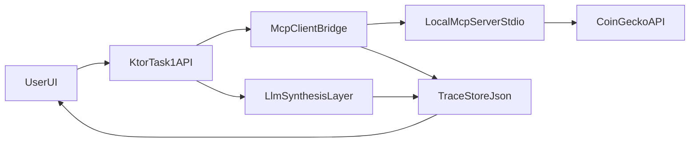

# Week 04

## Цель

Реализовать базовую связку:

- MCP-клиент в Kotlin/Ktor;
- локальный MCP-сервер на Kotlin SDK;
- инструменты поверх CoinGecko API;
- вызов инструмента из агентного потока;
- визуализация шагов `Client -> MCP -> API -> LLM` и метрик токенов.

## Что сделано

- Новый проект `weeks/week04` на Kotlin 2.2 + Ktor 3.1.
- Локальный MCP-сервер поднимается в stdio-режиме.
- MCP-клиент подключается к этому серверу и запрашивает список инструментов.
- Роутинг `MCP / NO-MCP` в `/api/chat` выполняется через LLM (YandexGPT) с fallback на эвристику, если нет ключей.
- Инструменты MCP:
  - `getCoinPrice`
  - `getTrendingCoins`
  - `getMarketSnapshot`
  - `getCoinOhlc`
- HTTP API для проверок:
  - `GET /api/mcp/status`
  - `GET /api/mcp/tools`
  - `POST /api/mcp/tool-call`
  - `POST /api/chat`
  - `GET /api/trace/latest`
  - `GET /api/trace/history`
- UI на Ktor HTML показывает:
  - чат на русском языке (ввод сообщения + история);
  - карточку цены BTC;
  - JSON со списком инструментов/ответами;
  - trace шагов и токены LLM.

## Структура проекта (`task1`)

- `task1/src/main/kotlin/week04/task1/App.kt`  
  Точка входа и wiring зависимостей.
- `task1/src/main/kotlin/week04/task1/api/TaskRoutes.kt`  
  HTTP API роуты (`/api/mcp/*`, `/api/chat`, `/api/trace/*`) и обработчики.
- `task1/src/main/kotlin/week04/task1/mcp/CoinGeckoMcpServer.kt`  
  Локальный MCP-сервер, регистрация инструментов (`addTool`) и `inputSchema`.
- `task1/src/main/kotlin/week04/task1/mcp/McpClientBridge.kt`  
  MCP-клиент (stdio), `connect`, `listTools`, `callTool`.
- `task1/src/main/kotlin/week04/task1/coingecko/CoinGeckoClient.kt`  
  HTTP-клиент CoinGecko и методы получения данных рынка.
- `task1/src/main/kotlin/week04/task1/service/ChatService.kt`  
  Выбор инструмента для запроса и LLM-synthesis (с токен-метриками).
- `task1/src/main/kotlin/week04/task1/storage/Stores.kt`  
  JSON-store для trace и истории tool-вызовов, плюс задел `JobStore`.
- `task1/src/main/kotlin/week04/task1/model/ApiModels.kt`  
  DTO запросов/ответов и модели trace/tokens.
- `task1/src/main/kotlin/week04/task1/ui/UiPage.kt`  
  Веб-страница (dashboard) и JS-логика кнопок/обновлений.
- `task1/src/main/kotlin/week04/task1/config/JsonConfig.kt`  
  Единая конфигурация `kotlinx.serialization`.
- `task1/src/main/kotlin/week04/task1/util/TraceUtils.kt`  
  Вспомогательные функции трассировки (`timedStep`) и конвертации аргументов MCP.
- `task1/src/main/resources/logback.xml`  
  Логирование в `stderr` для чистоты stdio-канала MCP.

## Запуск

Из каталога `weeks/week04`:

```bash
bash ./gradlew :task1:run
```

После запуска:

- http://127.0.0.1:6101

## Проверка требований ДЗ

1. **MCP соединение**
   - Открыть `GET /api/mcp/status` и убедиться, что `connected=true` после первого вызова tools/tool-call.
2. **Список инструментов**
   - Вызвать `GET /api/mcp/tools`.
   - Проверить, что вернулось больше одной функции (ожидается 4).
3. **Регистрация инструмента и параметры**
   - См. `addTool(... inputSchema ...)` в `task1/src/main/kotlin/week04/task1/mcp/CoinGeckoMcpServer.kt`.
4. **Вызов инструментов через агента**
   - `POST /api/chat` с текстом вопроса.
   - В ответе проверить `mcp_used`, `decision_reason`, `tool_used`/`tool_result` (если MCP использован) и `trace`.
5. **Токены и шаги**
   - Открыть `GET /api/trace/latest` или UI и посмотреть:
     - `steps` (`agent.tool.decision`, опционально `mcp.connect`/`mcp.tool.call:*`, `llm.synthesis`);
     - `llmDecision`, `llmSynthesis`, `llm` (`inputTokens`, `outputTokens`, `totalTokens`).

## Диаграмма



## Данные

Локальные файлы состояния:

- `weeks/week04/data/trace_history.json`
- `weeks/week04/data/tool_calls_history.json`
- `weeks/week04/data/scheduled_jobs.json` (задел для следующего задания про planner/background jobs)

Также добавлен интерфейс `JobStore` как задел для следующего задания с планировщиком/фоновыми задачами.
